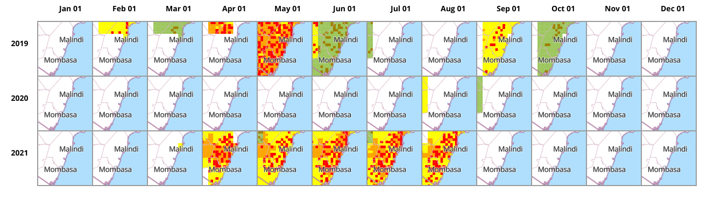

# Timeseries MBGL Renderer

Generate timeseries maps using Mapbox GL Style Configuration with [mbgl-renderer](https://github.com/consbio/mbgl-renderer) Web API


# Sample output



# Features:

- Render timeseries maps collage from a layer source that accepts dynamic dates
- All other features provided by [mbgl-renderer](https://github.com/consbio/mbgl-renderer).

This program generates a series of static maps from a pre-configured sequence of dynamic date parameters for a layer source and combines them in a 2D matrix image of years and timescale. The timescale can be dekads or months for now. More date sequence support will be added

# Installation

With [go](https://golang.org/doc/install) installed, run the command below to execute:

```go
go run main.go
```

# Usage

TODO
